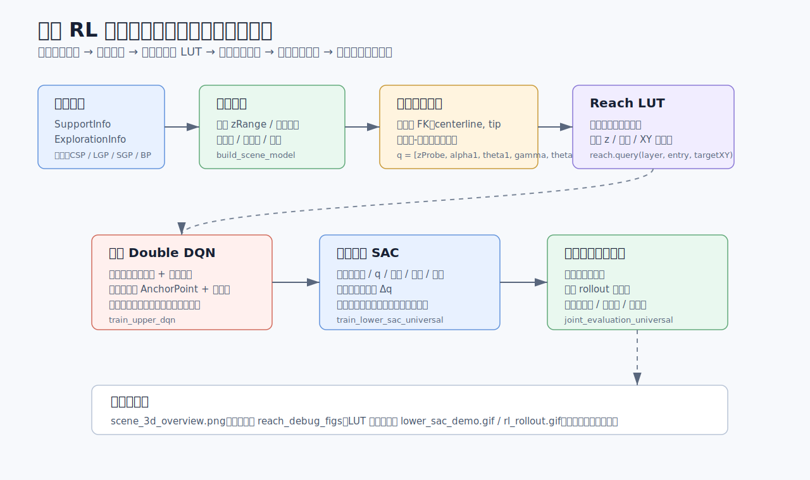

# MATLAB 双层 RL 连续体机械臂运动规划系统

本项目实现一个面向四层板间空间的连续体机械臂规划与控制流程：先从工程数据文件中构建三维场景，再离线生成入口到目标区域的可达性查找表，上层 DQN 负责序贯选择定位点/下探孔以覆盖多目标，下层通用 SAC 负责从选定入口连续控制机械臂到达目标并避障，最后通过联合评估和可视化工具验证效果。



## 整体技术路线

1. 数据解析：`load_all_layer_data.m` 读取四层 `SupportInfo` 和 `ExplorationInfo` 文本；`parse_support_info.m` 解析支撑柱、半径和孔位；`parse_exploration_info.m` 只保留 `RobotArm` 类型入口。
2. 场景建模：`build_scene_model.m` 生成 `scene`，包含层间 z 范围、目标圆/圆环区域、支撑柱、入口孔、网格边界和安全膨胀半径。
3. 运动学与碰撞：`continuum_forward_model.m` 使用常曲率模型计算 6 维构型 `q = [zProbe, alpha1, theta1, gamma, theta2, alpha3]` 下的中心线和末端；`collision_check_centerline.m` 检查中心线与支撑柱安全距离。
4. 可达性 LUT：`precompute_reachability.m` 对每个入口进行蒙特卡洛构型采样，过滤目标 z 附近且无碰撞的末端点，并写入 `(layer, entry, XY) -> reachable` 网格缓存。
5. 上层规划：`train_upper_dqn.m` 将多目标覆盖建成离散 Double DQN 问题，动作是当前层入口索引，奖励优先压缩定位点数量，其次压缩下探孔数量，同时要求覆盖目标。
6. 下层控制：`train_lower_sac_universal.m` 训练跨层共享 SAC 控制器，输入目标误差、构型、障碍、入口和层深度信息，输出连续增量动作 `Δq`。
7. 联合评估：`joint_evaluation_universal.m` 用上层策略选择入口序列，再调用下层 SAC rollout，统计覆盖率、到达成功率、碰撞率、平均定位点数和下探孔数。

## 实现细节与原理

### 上层 DQN

上层解决的是“多目标覆盖 + 资源最小化”问题。每个 episode 在某一层生成若干目标点，策略序贯选择入口，直到所有目标都被已选入口的可达域覆盖或达到步数上限。

状态编码在 `train_upper_dqn.m` 中实现，为固定维度向量：

```text
[层 one-hot,
 未覆盖目标数比例,
 未覆盖目标 XY 质心,
 未覆盖目标 XY 包围盒尺寸,
 已使用定位点 one-hot,
 已使用下探孔数量比例]
```

目标集本身是变长的，因此代码没有直接把所有目标拼接输入网络，而是用质心、包围盒和数量比例做固定维摘要。动作是当前层 `scene.layers(layerId).entries` 中的入口索引。训练时使用 Double DQN，并在网络输出维度上用 `maxActions` 兼容不同层入口数量。

奖励采用负成本思想：新定位点惩罚大于新下探孔惩罚，未覆盖新目标会被惩罚，覆盖新目标有小奖励，全覆盖有终局奖励。这样把优化优先级显式编码为：先少用定位点，再少用下探孔，最后满足覆盖约束。

### 下层 SAC

下层解决的是“给定入口和目标，连续控制机械臂无碰撞到达目标”。`train_lower_sac_universal.m` 训练一个跨层共享的 SAC，而不是每层单独训练。

观测维度为 27，主要包括：

- 目标相对末端误差和 3D 距离；
- 当前构型 `q` 的归一化值；
- 最近支撑柱距离、方向和半径；
- 上一步动作；
- 入口 XY、目标相对入口 XY；
- 当前层 `zProbe` 的上下界。

动作维度为 6，对应每一步的 `Δq`。奖励由靠近目标的势差奖励、目标附近奖励、净空奖励、动作平滑惩罚、碰撞惩罚、越界惩罚和到达奖励组成。

### 可达性 LUT

在线求解每个入口到每个目标是否存在无碰撞构型，代价很高。项目采用离线查表策略：`precompute_reachability.m` 对每层每个入口随机采样大量构型，调用 `continuum_forward_model.m` 得到末端位置，筛掉不在目标板面 z 附近或碰撞的样本，再将末端 XY 映射到网格。训练上层时只需要调用 `reach.query(layerId, entryIdx, targetXY)`，查询复杂度近似 O(1)。

### 运动学与碰撞

`continuum_forward_model.m` 按“+Z 向下”的工程坐标约定计算机械臂中心线。`entryStartZ = scene.layers(layerId).zRange(1)` 是下探起点所在板面，`zProbe` 是相对下探长度。两段连续体按常曲率段采样，中间包含直线连接段，最终输出 `centerline`、`tipPos` 和 `Ttip`。

碰撞检查基于中心线离支撑柱轴线的最小距离。`collision_check_centerline.m` 接收机械臂半径和安全裕量，判断中心线是否进入支撑柱膨胀区域。

## 环境建模描述

场景由 `load_all_layer_data.m` 和 `build_scene_model.m` 共同定义。

| 对象 | 建模方式 |
|---|---|
| 层间空间 | 四个空间：`CSP`, `LGP`, `SGP`, `BP`；z 范围分别为 `[0, 736.42]`, `[736.42, 1714.02]`, `[1714.02, 2209.62]`, `[2209.62, 2783.78]` mm |
| 目标区域 | `CSP` 为圆形区域；`LGP`, `SGP`, `BP` 为圆环区域，半径在 `build_scene_model.m` 的 `scene.targetRegions` 中定义 |
| 支撑柱 | 由 `*_SupportInfo(7).txt` 解析，半径小于等于 0 的点会被跳过，不作为障碍 |
| 入口孔 | 由 `*_ExplorationInfo(7).txt` 解析，只保留 `ExplorationType = RobotArm` 的记录 |
| 坐标映射 | `grid_label_to_xy.m` 将定位点标签映射到 XY；`hole_label_to_xy.m` 将下探孔标签映射到 XY |
| 网格范围 | `scene.gridBoundsX/Y = [-8, 8] * scene.gridPitch`，用于 LUT 和目标采样 |
| 安全膨胀 | `scene.safeInflation = scene.armRadius + scene.safetyMargin`，用于绘图和避障解释 |

目标采样不再从正方形区域均匀采样，而是通过 `sample_target_xy_by_layer.m` 按各层真实目标圆/圆环区域采样，并用 `point_inside_any_support.m` 和 Reach LUT 拒绝障碍内或不可达目标。

## 重要参数

| 参数 | 文件 | 默认值/示例 | 作用 |
|---|---|---:|---|
| `scene.gridPitch` | `build_scene_model.m` | `215.0` | 定位点网格间距，影响标签到 XY 的几何尺度 |
| `scene.holeRadius` | `build_scene_model.m` | `34.5` | 下探孔半径，用于可视化和场景说明 |
| `scene.armRadius` | `build_scene_model.m` / `main_rl_train.m` | `55/2` | 机械臂半径，用于碰撞与安全距离 |
| `scene.safetyMargin` | `build_scene_model.m` | `10.0` | 支撑柱安全裕量 |
| `scene.boardZ` | `build_scene_model.m` | `[736.42, 1714.02, 2209.62, 2783.78]` | 四个目标板面的 z 坐标 |
| `scene.targetRegions` | `build_scene_model.m` | 各层圆/圆环半径 | 限定异物可能出现的 XY 区域 |
| `robot.baseLen` | `main_rl_train.m` / `main_demo.m` | `25` | 机械臂基段长度 |
| `robot.seg1Len`, `robot.seg2Len` | `main_rl_train.m` / `main_demo.m` | `288`, `288` | 两段连续体长度 |
| `robot.link1Len`, `robot.link2Len` | `main_rl_train.m` / `main_demo.m` | `20`, `20` | 段间和末端直连段长度 |
| `robot.nProbe`, `nSeg1`, `nSeg2` | `main_rl_train.m` / `main_demo.m` | `20`, `80`, `80` | 中心线采样密度，影响绘图和碰撞检查精度 |
| `reach_opts.cellSize` | `main_rl_train.m` / `precompute_reachability.m` | `15` | Reach LUT 网格分辨率，越小越细但更慢 |
| `reach_opts.N_samples` | `main_rl_train.m` / `precompute_reachability.m` | `20000` | 每个入口蒙特卡洛采样数 |
| `reach_opts.dilateRadius` | `main_rl_train.m` / `precompute_reachability.m` | `1` | LUT 形态学膨胀半径，补偿采样稀疏 |
| `reach_opts.zTargetTol` | `main_rl_train.m` / `precompute_reachability.m` | `40` | 末端 z 距目标板面的容许误差 |
| `opts_upper.num_episodes` | `main_rl_train.m` / `train_upper_dqn.m` | `2000` | 上层 DQN 训练轮数 |
| `opts_upper.max_steps` | `main_rl_train.m` / `train_upper_dqn.m` | `15` | 单个 episode 最多选择多少个入口 |
| `opts_upper.hidden` | `main_rl_train.m` / `train_upper_dqn.m` | `[256 256]` | 上层网络隐藏层规模 |
| `opts_upper.n_targets_min/max` | `main_rl_train.m` / `train_upper_dqn.m` | `5 / 15` | 每个 episode 目标数量范围 |
| `opts_upper.R_NEW_ANCHOR` | `main_rl_train.m` / `train_upper_dqn.m` | `-15.0` | 新定位点惩罚，主优化目标 |
| `opts_upper.R_NEW_HOLE` | `main_rl_train.m` / `train_upper_dqn.m` | `-1.5` | 新下探孔惩罚，次优化目标 |
| `opts_upper.mask_used_holes` | `train_upper_dqn.m` | `true` | 是否屏蔽已经使用过的入口 |
| `opts_lower.num_episodes` | `main_rl_train.m` / `train_lower_sac_universal.m` | `5000` | 下层 SAC 训练轮数 |
| `opts_lower.max_steps` | `main_rl_train.m` / `train_lower_sac_universal.m` | `150` | 下层单次 rollout 最大步数 |
| `opts_lower.act_low/high` | `main_rl_train.m` / `train_lower_sac_universal.m` | 6 维上下界 | 限制每步 `Δq` 的动作范围 |
| `opts_lower.goal_radius` | `train_lower_sac_universal.m` | `35.0` | 末端到目标距离小于该值视为成功 |
| `opts_lower.R_goal` | `main_rl_train.m` / `train_lower_sac_universal.m` | `300.0` | 到达目标奖励 |
| `opts_lower.R_collision` | `main_rl_train.m` / `train_lower_sac_universal.m` | `50.0` | 碰撞惩罚 |
| `opts_lower.k_reach` | `main_rl_train.m` / `train_lower_sac_universal.m` | `8.0` | 靠近目标的势差奖励系数 |

## 验证与工具代码

### 场景验证

- `demo_plot_scene_3d.m`：读取数据、构建场景并生成 `scene_3d_overview.png`。
- `plot_scene_3d_overview.m`：绘制四层板、支撑柱、入口点和真实目标区域边界。

### Reach LUT 验证

- `debug_plot_reach_lut.m`：加载 `reachability_lut.mat` 并生成 Reach LUT 调试图。
- `plot_reachability_lut_debug.m`：输出 summary 图、per-entry 图和 `reach_lut_stats.txt`，用于检查 LUT 是否过稀、目标区域是否匹配。

### 下层 SAC 验证

- `demo_lower_sac_visualization.m`：加载 `lower_sac_universal.mat` 和 `reachability_lut.mat`，自动或手动选择案例并播放/保存下层 SAC 轨迹。
- `animate_lower_sac_rollout.m`：生成三维动画，同时绘制距离、净空、构型和动作范数曲线。
- `rollout_lower_sac_universal.m`：执行一次确定性或采样式下层 rollout，返回轨迹和成功/碰撞信息。

### 联合评估与演示

- `joint_evaluation_universal.m`：评估上层入口规划和下层 SAC 实际执行效果。
- `main_demo.m`：不依赖训练结果的快速演示入口，使用启发式轨迹生成 `demo_rollout.gif`。
- `run_upper_qlearning_demo.m`：早期表格 Q-learning 示例，用于理解上层入口选择思想。
- `run_lower_sac_setup.m`：基于 MATLAB Reinforcement Learning Toolbox 的旧版 SAC 环境/agent 创建示例；主训练流程不依赖该工具箱。

## 使用说明

### 1. 准备数据

确保以下 8 个文本文件与 MATLAB 代码位于同一目录：

- `CSP_SupportInfo(7).txt`
- `LGP_SupportInfo(7).txt`
- `SGP_SupportInfo(7).txt`
- `BP_SupportInfo(7).txt`
- `CSP_ExplorationInfo(7).txt`
- `LGP_ExplorationInfo(7).txt`
- `SGP_ExplorationInfo(7).txt`
- `BP_ExplorationInfo(7).txt`

### 2. 查看场景

```matlab
cd 'e:\04 其他huo\13.机器臂运动规划方法代码\matlab_rl_continuum_rl_v3'
demo_plot_scene_3d
```

输出：`scene_3d_overview.png`。

### 3. 快速运行无训练演示

```matlab
main_demo
```

输出：`demo_rollout.gif`。该脚本用于查看场景、入口选择和启发式轨迹效果，不代表最终 RL 策略性能。

### 4. 运行完整 RL 训练

```matlab
main_rl_train
```

首次运行会生成或加载 `reachability_lut.mat`。如果没有缓存，Reach LUT 预计算耗时较长；随后会训练上层 DQN、下层通用 SAC，并执行联合评估。

主要输出包括：

- `reachability_lut.mat`：入口可达性查找表；
- `upper_dqn_result.mat`：上层 DQN 训练结果；
- `lower_sac_universal.mat`：通用下层 SAC 训练结果；
- `rl_rollout.gif`：联合评估中的示例轨迹动画。

快速调试时可先在 `main_rl_train.m` 中临时调小：

```matlab
opts_upper.num_episodes = 400;
opts_lower.num_episodes = 500;
reach_opts.N_samples = 1500;
reach_opts.cellSize = 50;
```

### 5. 检查 Reach LUT

在已经生成 `reachability_lut.mat` 后运行：

```matlab
debug_plot_reach_lut
```

输出目录：`reach_debug_figs`。

### 6. 可视化训练好的下层 SAC

在已经生成 `lower_sac_universal.mat` 和 `reachability_lut.mat` 后运行：

```matlab
results = demo_lower_sac_visualization();
```

可指定层、入口、目标和 GIF 路径：

```matlab
results = demo_lower_sac_visualization( ...
    'layerId', 2, ...
    'entryIdx', 10, ...
    'gifFile', 'lower_sac_demo.gif', ...
    'maxSteps', 150);
```

## 依赖

- MATLAB R2022b 或更高版本。
- 主训练代码使用 Deep Learning Toolbox 中的 `dlnetwork` / `dlarray` / `dlfeval`。
- `main_rl_train.m`、`train_upper_dqn.m`、`train_lower_sac_universal.m` 不依赖 Reinforcement Learning Toolbox。
- `run_lower_sac_setup.m` 是旧版工具箱式示例，需要 Reinforcement Learning Toolbox。

更多训练细节可参考 `README_RL.md`。
